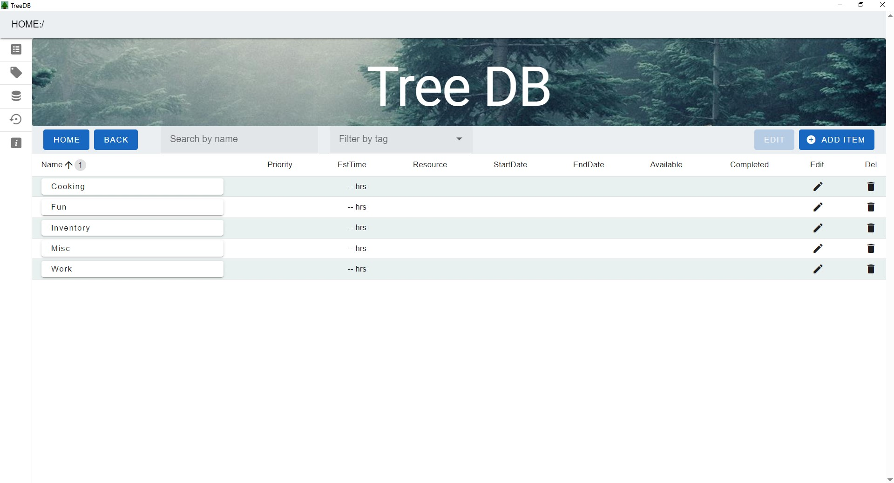
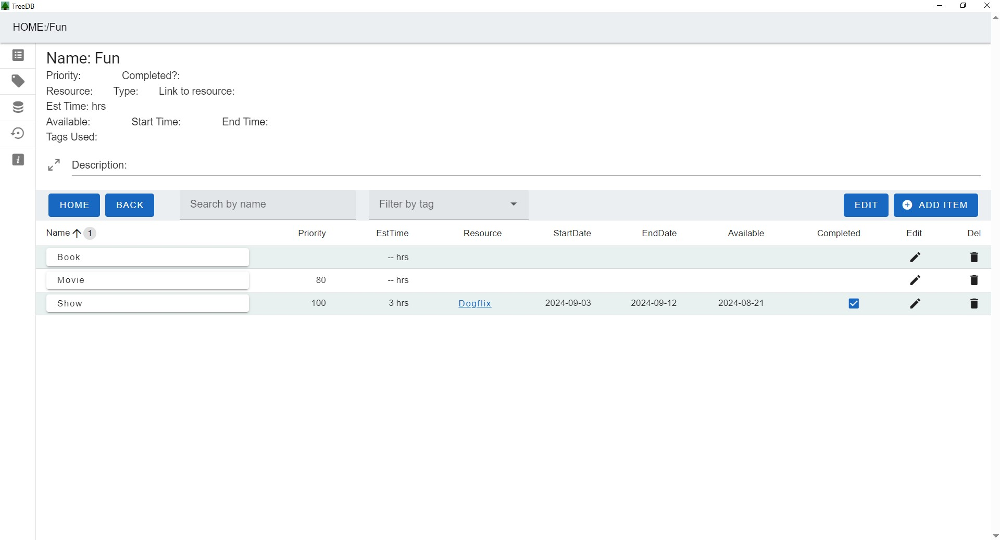
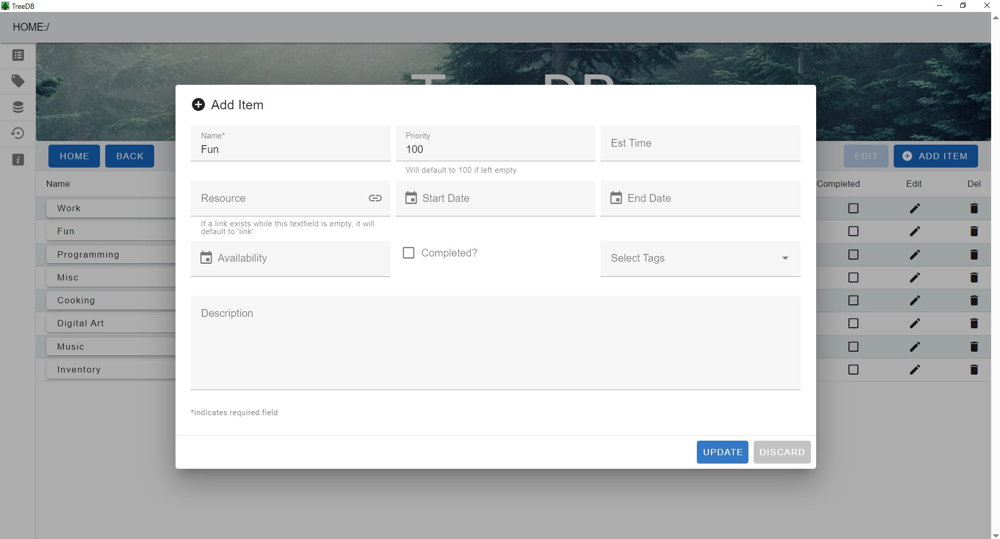
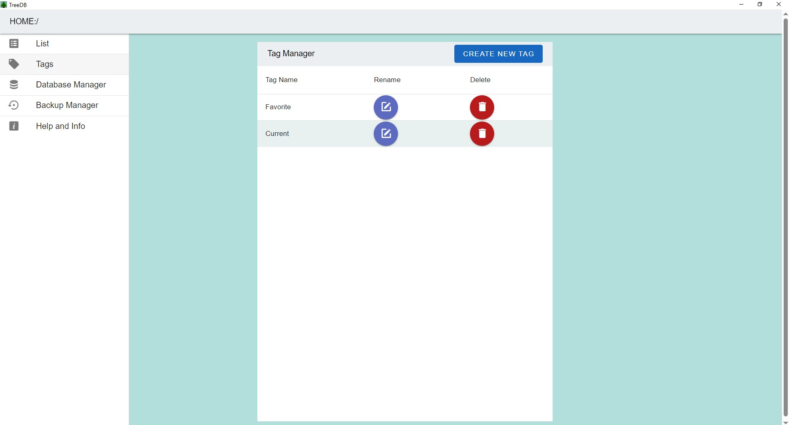
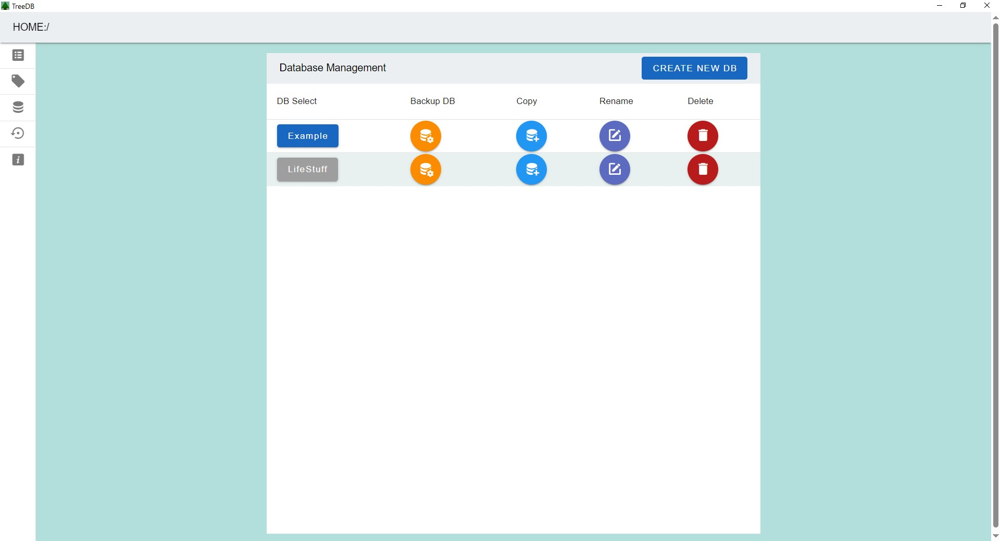
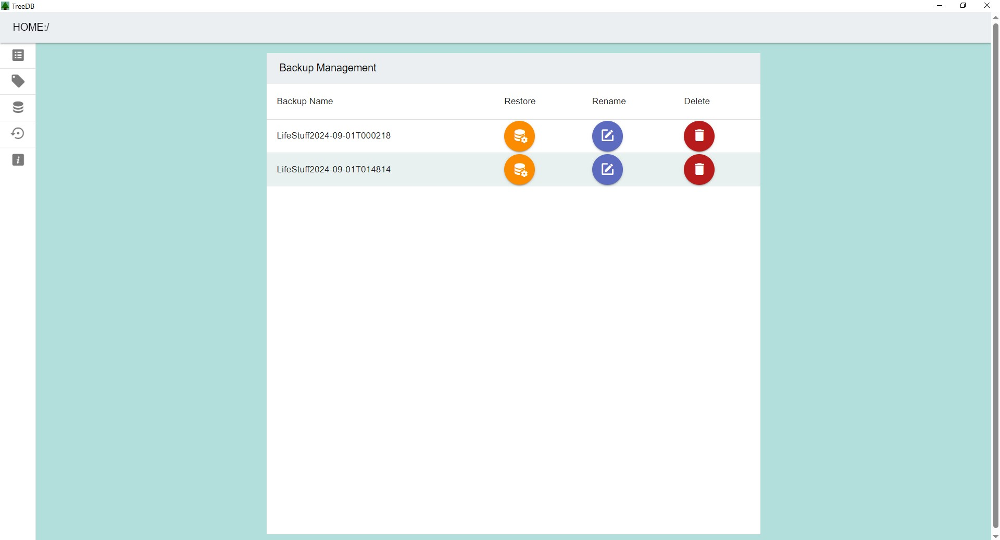

## Personal Database for Desktop
A release version can be found [here](https://github.com/kcharris/PersonalDatabaseDesktop/releases/tag/1.0.0), or on the right under releases.  

### Overview
This is a tool to manage user created nested lists of items, that can be kept track of over time, that don't want to be forgotten. A few examples include: movies, books, music, games, art projects, chores around the house, and cooking ideas. Tens to hundreds of things in each category can build up over time and become hard to manage. This tools aims to make their management easier and more efficient.  

General categories can be broken down until items are actionable. An example of this would be a Fun category that breaks down into movies, comics, books, and games. Then, each of these subcategories can be filled with specific items. A specific movie may be actionable because it can be watched. In addition, under a movie can include items such as "look up the music" or "find out who the actors are."  

This tool is best used in conjunction with a calendar, where items can be placed for use.  

### Application screenshots

  
  
  
  
  
  

### Ease of Use
* Quick Search within every layer by typing in the search bar. Items are filtered on input using subsequences.
* A Tag management system that allows items to be filtered by Tag.
* Multi-sort by data headers. Data headers can be given priority in the sort process by clicking between them.
* Calendar dialog boxes.
* Quickly create and edit items with easy to access dialog boxes.

### Database Management
* Allows the CRUD management of different databases so users can keep different lists
* Allows users to backup databases where they can be managed on another page

### Data
This tool generalizes items and their properties for management. Here are the properties of each item. Tag and ItemTag tables also exist for database management.

| | | | |
| --- | --- | --- | --- |
| Name | Parent | Priority | Estimated Time |
| Start Date | End Date | Resource | Availability |
| Completed | Description | Resource Type | Resource Link |

### Tools Used
* Tauri
* Rust
* Vue
* Typescript
* Vuetify
* SQLite
* SeaORM
* VS Code
